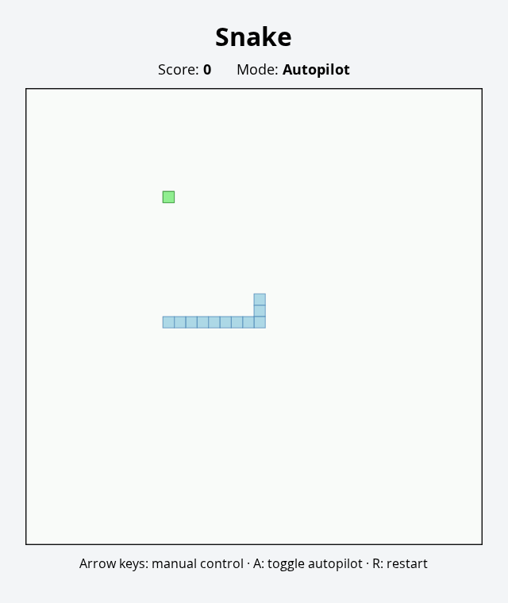

# Snake Game JS

A browser-based Snake game with two play styles:

- **Autopilot** chooses a safe neighboring cell that moves the snake toward the food using toroidal (wrap-around) distance.
- **Manual mode** uses the arrow keys and prevents immediate 180-degree reversals.

The board wraps at every edge, so moving off one side brings the snake back on the opposite side.

## Demo



*Animated from the current wrap-around autopilot behavior.*

## Controls

- Arrow keys — switch to manual mode and steer
- `A` — toggle autopilot/manual mode
- `R` — restart

Eating food increases the score, grows the snake, and gradually increases game speed.

## Run

No build step is required. Open `snakegame.html` in a browser.

## Test

The game core is also exported for Node-based tests:

```bash
npm test
```

The tests cover edge wrapping, toroidal distance, collision lookup, and autopilot direction selection.
